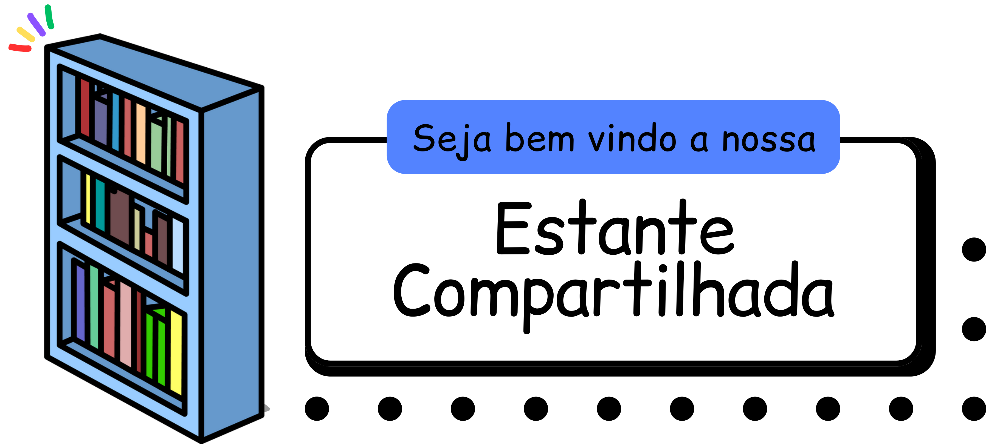

# Executando a Aplicação

## ⚙️ Pré-requisitos

- Node.js e npm devem estar instalados na sua máquina.

- Você precisa ter o PostgreSQL instalado na sua máquina para o funcionamento correto da aplicação.

‼️ **Por favor, certifique-se de configurar o PostgreSQL com as seguintes credenciais:**
  - Usuário: "postgres"
  - Host: "localhost"
  - Banco de Dados: "postgres"
  - Senha: "postgres"
  - Porta: 5432

## 📌 Instalação

1. Clone este repositório para sua máquina local.

```bash
git clone https://github.com/edrassimoes/nouvenn-livros.git
```

2. Dentro da pasta nouvenn-livros, instale as dependências usando npm.
```bash
npm install
```

4. Executando a Aplicação.
Após instalar as dependências, você pode executar a aplicação usando o comando npm start, que utilizará o pacote concurrently para iniciar os processos do cliente e do servidor simultaneamente.
```bash
npm start
```
5. Acesso:
- 👤 Cliente: http://localhost:5173
- 📡 Servidor: http://localhost:3000

## Estrutura do Projeto
- 📂 client/: Contém o código do cliente.
- 📂 server/: Contém o código do servidor.
- 📂 test/: Contém os arquivos de teste.
- 📂 docker/: Contém o Dockerfile.

---

<div display="flex" align="center">
  <p font-size="12px"><i>Repositório destinado a segunda etapa do processo seletivo para a vaga de Estágio em Desenvolvimento de Software na Nouvenn.</i></p>
  
</div>
